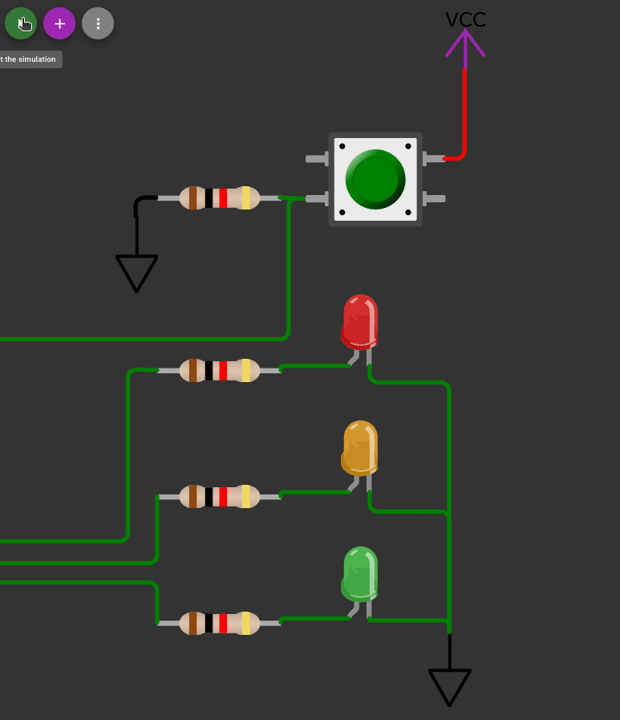
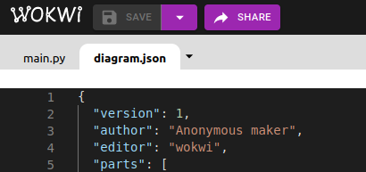

# Python para sistemas embebidos :snake:
Repositorio público con información de guía para el desarrollo de prácticas de programación de micropython en sistemas embebidos (esp32)

---

Contenido:

- [ESP32](#la-tarjeta-de-desarrollo-esp32)
- [MicroPython](#micropython)
- [Instalación MicroPython](#instalación-de-micropython-en-esp32)
- [Instalación Thonny](#instalación-de-thonny-entorno-práctico-de-programación)
- [Uso de pines](#uso-adecuado-de-pines-de-la-placa-esp32)
- [Entorno de simulación](#micropython-para-esp32-en-entorno-de-simulación)
- [Información de ayuda](#información-de-ayuda)
- [Taller 1 :page_facing_up: :heavy_check_mark:](#taller-1)
- [Taller 2 :page_facing_up:](#taller-2)
- [:sparkles: Códigos de ayuda :sparkles:](#codigos-de-ayuda)
- [Ejercicio Final :bulb:](#ejercicio-final)

---

# La tarjeta de desarrollo [ESP32]


ESP32 es una familia de microcontroladores de la empresa **Espressif Systems**. Cuenta con un microprocesador de 32-bits (dual core o single core), comunicación inalámbrica Wifi y Bluetooth. Su versión de dos núcleos se podría realizar un proyecto que intercambie información a la nube y en simultáneo administre datos de un sensor.

# MicroPython
Es una implementación sencilla y eficiente del lenguaje de programación **Python 3** que incluye un pequeño subconjunto de la biblioteca estándar de Python y está optimizado para ejecutarse en microcontroladores y en entornos restringidos.

# Instalación de micropython en Esp32

1. Descargar la herramienta `esptool.exe` _([para windows](https://dl.espressif.com/dl/esptool-2.3.1-windows.zip))_
2. Descargar el firmware `esp32-ota-20220618-v1.19.1.bin`, la carga de este archivo binario a la tarjeta esp32 permitirá programar en micropython.
3. Guardar los dos archivos dentro de la misma carpeta
4. Abrir cmd dentro de la carpeta mencionada, _puede acceder rápidamente a la carpeta escribiendo "cmd" en la ruta del explorador de archivos_.
5. Borrar todo programa guardado previamente en la esp32:
```cmd
esptool.exe --chip esp32 --port COM6 erase_flash
```
 - **Nota:** Recuerde seleccionar el puerto COM adecuado según donde se haya conectado la tarjeta.
 - Si el sistema operativo no reconoce la tarjeta, asegúrese de que tiene instalador el controlador requerido `CP210x` [Ir a página de descarga](https://www.silabs.com/developers/usb-to-uart-bridge-vcp-drivers?tab=downloads)
6. Cargar el firmware:
```cmd
esptool.exe --chip esp32 --port COM6 --baud 460800 write_flash -z 0x1000 esp32-ota-20220618-v1.19.1.bin
```
 - **Nota:** En algunas tarjetas hay que mantener presionado el [ pulsador EN ] para forzar a la tarjeta a recibir el programa.
 
 # Instalación de Thonny _(entorno práctico de programación)_
 
 1. Descargue e instale el programa desde el [siguiente enlace](https://thonny.org/). _Durante la instalación puede traducirlo al español si lo desea_.
 2. Vaya a: Herramientas > Opciones [Se abre ventana de opciones]
 3. En la pestaña |Intérprete|, en el menú desplegable selecciones `MicroPython (ESP32)`
 4. Abajo en Puerto o WebREPL seleccione el puerto COM de la tarjeta. Finalmente presione [OK].
 
 - Thonny tiene dos entornos de trabajo, el superior es donde se desarrollan los códigos y en la parte inferior está la consola, con la cual puede interactuar directamente con la esp32.
 - Los programas los puede ejecutar directamente presionando el botón de play que se encuentra al lado del botón de guardar, o puede presionar la tecla [F5].
 - Para detener la ejecución del programa presiona Stop, o [Ctrl] + [F2].
 - **IMPORTANTE:** el programa se pierde una vez se detiene o se desconecta la tarjeta; para asegurar que el programa quede guardado en esta y que adicionalmente se ejecute en el arranque debe guardar el programa como `main.py` directamente en la tarjeta dando Archivo > Guardar como... si la tarjeta está conectada aparecerá una ventana que permite elegir si el código será guardado en el PC o directamente en la tarjeta.
 
 # Uso adecuado de pines de la placa esp32
 
 La tarjeta opera a 3.3 voltios, y es sensible a voltajes superiores _(no tolera 5 voltios, se puede averiar)_ y a descarga estática por mala manipulación.
 Algunos pines se recomienda no usarlos ya que intervienen en algunas configuraciones de arranque, otros pines solo funcionan como entradas, en [este enlace](https://randomnerdtutorials.com/esp32-pinout-reference-gpios/) se detalla la disponibilidad de cada pin.
 
 # MicroPython para ESP32 en entorno de simulación
 
 **Wokwi** es un simulador de electrónica en línea. Puede usarlo para simular Arduino, ESP32 y muchas otras placas, piezas y sensores populares. Esta es una herramienta poderosa y versátil que incluso permite simular la tarjeta esp32 junto con programación en micropython.
 La plataforma es de libre acceso y se puede acceder haciendo [clic aquí](https://wokwi.com/projects/new/micropython-esp32).
 
 ---
 
 # Información de ayuda
 
 - Información de micropython orientada a ESP32: https://docs.micropython.org/en/latest/esp32/quickref.html
 - Información general de python 1: https://www.geeksforgeeks.org/python-programming-language/
 - Información general de python 2: https://devdocs.io/python~3.10/
 
 # Taller 1

1. :question: Describa las principales características de la tarjeta Esp32, como voltaje y frecuencia de operación, arquitectura del procesador, tipos de comunicación que ofrece _(wifi, bluetooth, spi, etc...)_, pines de entrada y salida y sus funcionalidades _(pwm, adc, dac, interrupts)_, particularmente consultar por qué no se recomienda utilizar algunos pines  e identificar cuáles son.
2. :question: Averiguar en qué consiste micropython y en qué se diferencia del python convencional.
3. :question: Consultar las bibliotecas más comúnmente usadas en micropython y listar algunas de sus funciones con explicación breve _(machine, time, os, network,...)_

# Taller 2

Para el siguiente taller se requiere desarrollar el respectivo códgio en micropython y simular los siguientes ejercicios:

1. Simular un semáforo peatonal que se activa manualmente con un pulsador, este normalmente ha de estar en rojo y al presionarlo debe pasar a verde por 7 segundos, luego amarillo 3 segudos y vuelve a rojo, la secuencia se debe ejecutar solamente cuando se presione el botón.



2. Presentar el código [ **main.py** ] en un archivo de word junto con el diagrama de conexiones que está en la pestaña del lado derecho [ **diagram.json** ], con esa información se puede verificar el programa sin necesidad de guardarlo en la plataforma web.



# Codigos de ayuda

- [Salida digital](ejemplos/Ejercicios.md#usar-salida-digital)
- [Entrada digital](ejemplos/Ejercicios.md#usar-entrada-digital)
- [Entrada analógica](ejemplos/Ejercicios.md#usar-entrada-analógica)
- [Uso de input](ejemplos/Ejercicios.md#usar-función-input)
- [Uso de listas](ejemplos/Ejercicios.md#uso-de-listas-o-arrays)
- [Recorrer listas con entrada analógica](ejemplos/Ejercicios.md#recorrer-una-lista-a-voluntad)
- [Entrada analogica salida digital](ejemplos/Ejercicios.md#uso-de-entrada-analogica-para-controlar-una-salida)

# Ejercicio final

Para el ejercicio propuesto: **Control manual y automatico del riego de una plana** se deben tener en cuenta los siguientes requerimientos:

 1. Inicialmente llenar una lista de tres con nombres de personas
 2. Con un switch debe poder seleccionar entre modo manual o automático
 3. En el modo automatico: se lee la entrada analogica y dependiendo del valor se debe regar o no la planta, para eso se usa una salida digital conectada a un led que indique en encendido que debe regar la planta y apagado cuando no. La idea es que se riege cuando el valor de la entrada analógica esté aproximadamente por debajo del 25% o por debajo de 1023.
 4. En el modo manual: Igualmente se lee la entrada analogica pero ya no se hace el riego, solamente se debe mostrar un mensaje que diga _X_ persona debe regar la planta. Cada vez que el valor de la entrada analogica esté por debajo del 25% o 1023 debe ir cambiando el nombre de la persona, es decir debe ir recorriendo la lista de las personas que se pidieron al inicio del programa.

:clipboard: Con los códigos de ayuda y practicamente con los dos últimos se puede desarrollar el ejercicio propuesto. :clipboard:

 Los materiales que se requieren para el montaje son:

 - ESP32
 - Protoboard
 - Potenciometro de 10K Ohms
 - Led _cualquier color_
 - resistencia 220 Ohms para el led
 - switch _también dip switch_
 - resistencia 1K Ohms
 - jumpers